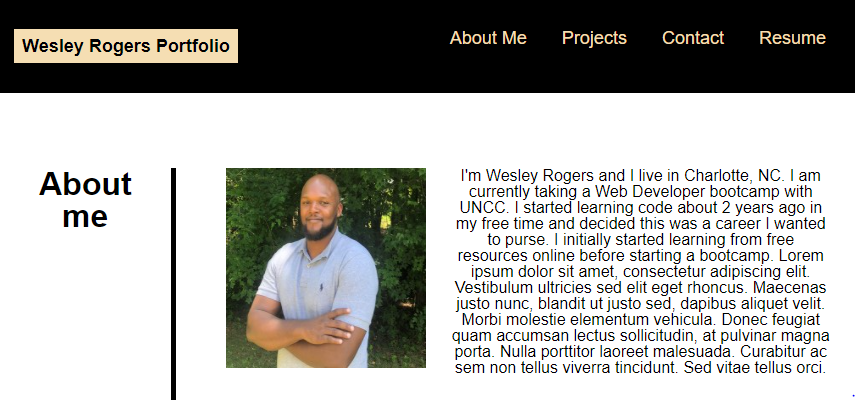

# Wesley Rogers Portfolio

## Table of Contents
- [Description](#Description)
- [Visual](#Visual)
- [Link](#Link)
- [Usage](#Usage)

## Description
 
 This is a website displaying projects that I have created. The website was created using HTML and CSS. There are links to each project to further show my skills as a developer. There is also a contact section where I have provide mutliple way of contacting me regarding any questions. 
 
## Visual

## Usage 

1. Select projects from the menu bar.
2. Click on each image to visit the website. 

## Link

[Portfolio](https://wparker05.github.io/wesley-rogers-portfolio/)

